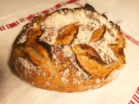

<html>
<head>
<meta name="viewport" content="width=device-width, initial-scale=1.0">

</head>
<body style="font-family:Verdana;">

  <h1>Welcome to the magic world of sourdough bread</h1>
  <h3> Probably many of you have heard about the sourdough.
    If you are here because wnat to know more about it it's perfectly fine,
    we will tell you what is behind what lies behind the word <em>sourdough</em>. 
    In case that you just want to pick your favorite type of bread,
    click on it and have it in a couple of hours on your table, you are also at the perfect place.</h3>

  

    
The starter

    
The leaven

    
The dough

    
The bread

  

  

    <h2>The bread</h2>
    
Sourdough is a bread made from the natural occurring yeast and bacteria
        in flour. In traditional sourdough recipes, you’ll find three ingredients:
        sourdough starter (which consists of flour and water), salt and flour.
        There is no yeast, no milk, no oils and no sweeteners.
        It’s about as natural as you get when it comes to bread. 

    
  

  

    <h2>What?</h2>
    
Bakery porducts in which only naturally occuring yeast us used

    <h2>Where?</h2>
    
In the larger capital area of Finland alias Uusimaa.

    <h2>Price?</h2>
    
Each product has different price based on its weight and baling complexity

  

 This web page is a personal page where the page owner presents its bread baking hobby.

</body>
</html>
